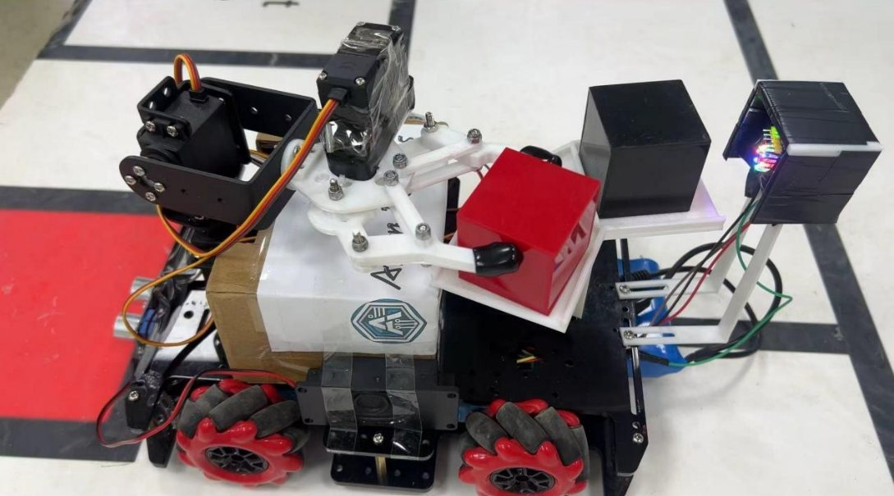

# Arduino Mega 取放分拣机器人展示仓库

[](https://github.com/zihanshen29/arduino-mega-pick-place-showcase/actions/workflows/ci.yml)

这是一个面向公开工程审阅的 Arduino Mega 2560 移动取放/分拣机器人项目伴随仓库。仓库用合成传感器日志和简化状态机复刻项目工程结构，展示有限状态机、巡线修正、超声波目标确认、颜色识别、舵机抓取和任务指标分析流程。

## 仓库定位

该仓库是公开展示版，不是原始课程/团队项目的完整私有代码。仓库中的日志、指标和图表均为 synthetic/demo 数据，用于说明工程拆解、控制流程和测试思路，不代表真实硬件验收结果。

固件目录中的 Arduino sketch 是 sanitized skeleton，用于展示状态机组织方式和接口边界，不是完整现场调参版本，也不包含私有传感器标定、真实硬件日志或不可公开路径。

## 项目背景

原项目方向是工业危险废物自主管理机器人系统开发，平台为 Arduino Mega 2560，包含直流电机驱动、灰度巡线传感器、HC-SR04 超声波、颜色传感器、LCD、语音模块、ESP8266/Serial1 遥测和舵机机械臂等模块。本人任 6 人团队队长兼软件工程师：控制逻辑与软件全部由本人负责，队友分管机械结构与硬件装调。公开版保留可审阅的控制架构和合成数据分析流程。

## 展示能力

- 使用有限状态机描述离开仓位、巡线、目标确认、抓取、颜色识别、分类投放和回程复位。
- 用合成日志展示 line error、PWM 修正、超声波距离、颜色置信度、舵机角度和状态切换事件。
- 用 Python 脚本生成 sample logs、解析日志、计算任务完成步数、状态占比、巡线误差和分类成功率。
- 提供一份脱敏 Arduino C/C++ demo firmware skeleton，展示状态机组织方式。
- 提供中文 GitHub Pages 项目页和公开工程说明。

## Two engineering stories

### Story 1: turning blanking window

问题：直角弯/掉头时，转弯刚开始就被“重新检测到黑线”的终止条件打断，车身还没转够就进入全白/丢线分支。根因不是采样太快，而是终止条件在起始阶段消费了原黑线信号。

修改：转弯开始后先加消隐延迟，让车离开原黑线，再武装黑线重捕获检测；同时调节灰度传感器灵敏度并清理场地污渍。结果：直角弯/掉头成功率从约 30% 提升到接近 100%。这个机制可以类比按键去抖或雷达消隐：先屏蔽旧信号，再重新采信新信号。

### Story 2: dual-object turntable

问题：初版“单物块 + 重跑两次”会把全流程高风险环节重复两遍，时间和失败暴露面都接近翻倍。

决策：加装可旋转云台，一次携带两个物块，投放阶段逐个检测颜色、旋转云台对位并按颜色映射投放；循迹逻辑按出发、返回、放置阶段拆分，由 FSM 切换。结果：搬运时间相比重跑方案缩短约 43%，云台方案从提出到联调稳定约 2 周。

### Table AR-1. Impact summary

| Improvement | Method | Quantified effect |
| --- | --- | --- |
| Turning logic | black-line recapture + start blanking delay | success rate about 30% -> near 100% |
| Dual-object carrying | one rotating turntable carries two blocks instead of running twice | about 43% time saving; about 2 weeks to stabilize in integration |

## Firmware facts (from the original project)

真实参数以表格文字呈现；公开 sketch 仍是 sanitized skeleton，不改成现场完整调参版本。

| Area | Verified facts |
| --- | --- |
| Role | 6 人团队队长 + 软件工程师；控制/软件全部本人负责，队友分管机械与硬件，联调本人牵头 |
| Line following PID | Kp=25, Ki=0.1, Kd=5 |
| Turntable servo | SLOT1=0°, SLOT2=145° after 170°−25° on-site correction |
| Smooth rotation | 2° per step + 50 ms per step |
| Color detection | HSL thresholds + 3 s / 10-sample voting |
| Ultrasonic debounce | 3 consecutive samples |
| Right-angle turn | 280–750 ms delay + black-line recapture |
| Turnaround | 1545–1600 ms timed open-loop turn |

## 实物照片



Caption: Real project photo — dual-block carrying (2025). The photo shows the robot carrying red and black blocks on the turntable; it is separate from the synthetic/demo logs in this repository.

## 快速运行

```powershell
python -m venv .venv
.\.venv\Scripts\Activate.ps1
pip install -e ".[test]"
python scripts\run_demo_pipeline.py
pytest
```

生成文件会写到 `data/sample_logs/` 和 `outputs/`，这些都是本地 demo 产物。

## 仓库结构

```text
arduino-mega-pick-place-showcase/
|-- README.md
|-- docs/
|   |-- assets/
|   |   `-- media/
|   |-- index.html
|   `-- architecture.md
|-- firmware/
|   `-- robot_controller_demo/
|       `-- robot_controller_demo.ino
|-- src/
|   `-- arduino_showcase/
|-- scripts/
|-- tests/
|-- data/
`-- outputs/
```

## 边界说明

- 不包含真实私有硬件日志、原始课程仓库、账号信息、内部路径或不可公开资料。
- Arduino sketch 是 sanitized skeleton，用于说明状态机结构，不是完整现场调参版本。
- Python 仿真是简化 demo，不是物理动力学模型。
- 所有 metrics 均来自合成 demo 数据。
