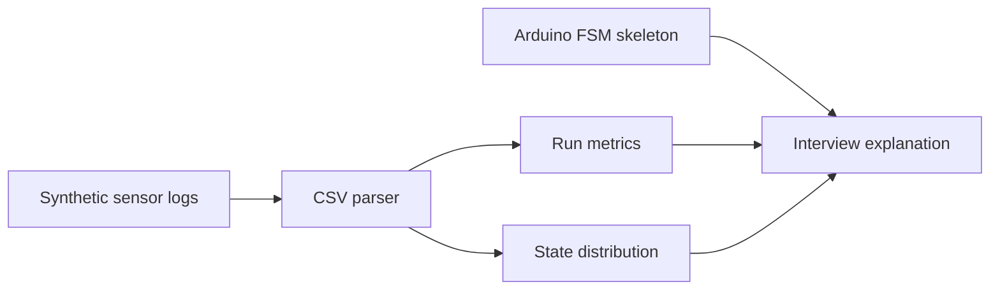

# 架构说明

```mermaid
flowchart LR
    A["Synthetic sensor logs"] --> B["CSV parser"]
    B --> C["Run metrics"]
    B --> D["State distribution"]
    E["Arduino FSM skeleton"] --> F["Interview explanation"]
    C --> F
    D --> F
```

公开版仓库围绕两条线组织：

- `firmware/` 展示 Arduino C/C++ 有限状态机的组织方式。
- `src/` 和 `scripts/` 展示如何用合成日志复盘状态切换、巡线误差、超声波距离、颜色置信度和遥测完整性。

所有数据均为 synthetic/demo，不是现场硬件记录。

