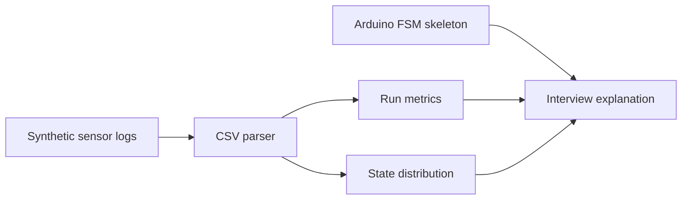

# 架构说明

公开版仓库围绕两条线组织：

- `firmware/` 展示 Arduino C/C++ 有限状态机的组织方式。
- `src/` 和 `scripts/` 展示如何用合成日志复盘状态切换、巡线误差、超声波距离、颜色置信度和遥测完整性。

原项目中，本人任 6 人团队队长兼软件工程师，负责控制逻辑与软件实现。公开仓库保留两条面试可讲的工程主线：转弯消隐窗把成功率从约 30% 提升到接近 100%，云台双物块方案让搬运时间缩短约 43%。

所有数据均为 synthetic/demo，不是真实现场硬件记录。固件是 sanitized skeleton，用来说明控制结构和接口边界，不包含完整私有代码、现场调参细节或传感器标定表。
